#  Лабораторная работа. Базовая настройка коммутатора

###  Задание:

+ Часть 1. Проверка конфигурации коммутатора по умолчанию
+ Часть 2. Создание сети и настройка основных параметров устройства
  + Настройте базовые параметры коммутатора.
  + Настройте IP-адрес для ПК.
+ Часть 3. Проверка сетевых подключений
  + Отобразите конфигурацию устройства.
  + Протестируйте сквозное соединение, отправив эхо-запрос.
  + Протестируйте возможности удаленного управления с помощью Telnet.

### Топология:

### Таблица адресации:

|    Устройство    |   Интерфейс    |    IP-адрес/префикс      |
|-----------------:|:---------------|-------------------------:|
|       S1         |     VLAN 1     |    192.168.1.2/24        |
|      PC-A        |      NIC       |    192.168.1.1/24        |

### Домашнее задание:

Подключимся к коммутатору(через console порт), перейдем в привилегированный режим и убедимся, что на коммутаторе находится пустой файл конфигурации (startup-config) по умолчанию.

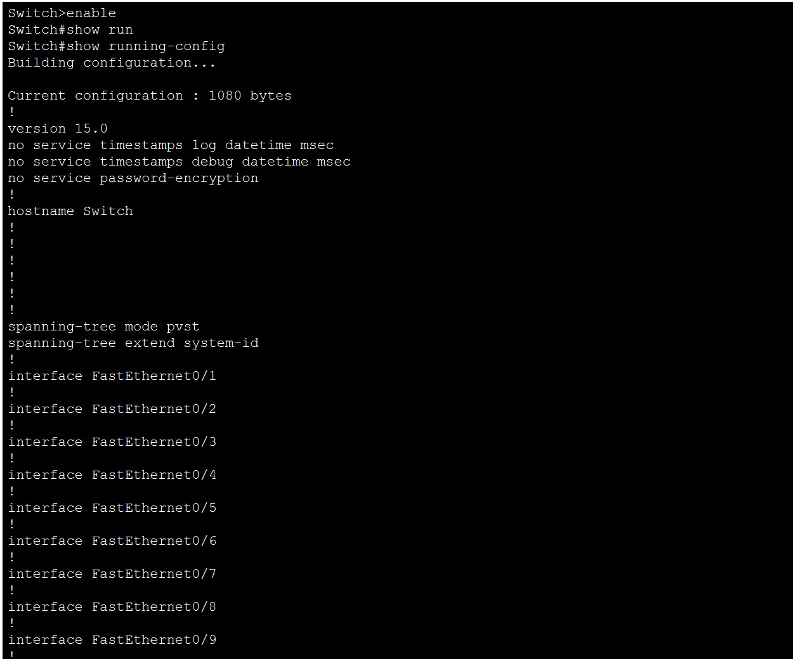

Проверим характеристики SVI для VLAN 1:

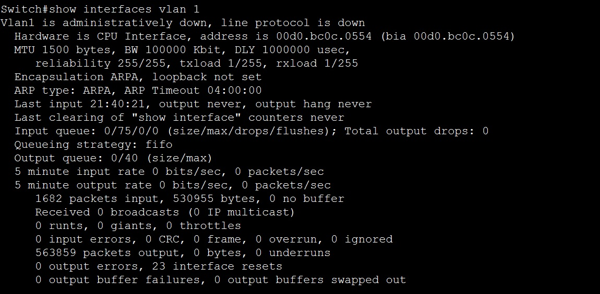

Изучим сведения о версии ОС Cisco IOS на коммутаторе коммандой show version:

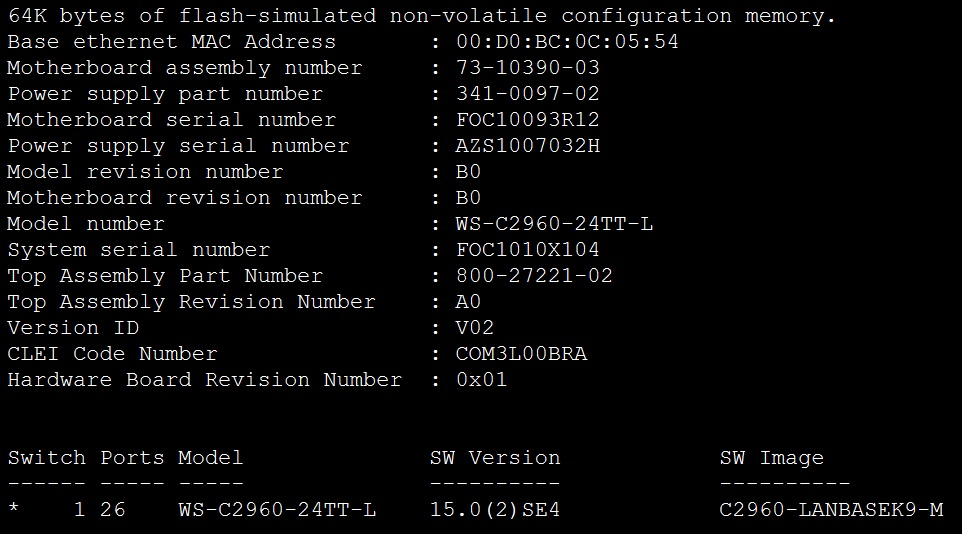

Подключим компьютер к коммутатору в порт fastethernet0/6 и проверим его состояние:

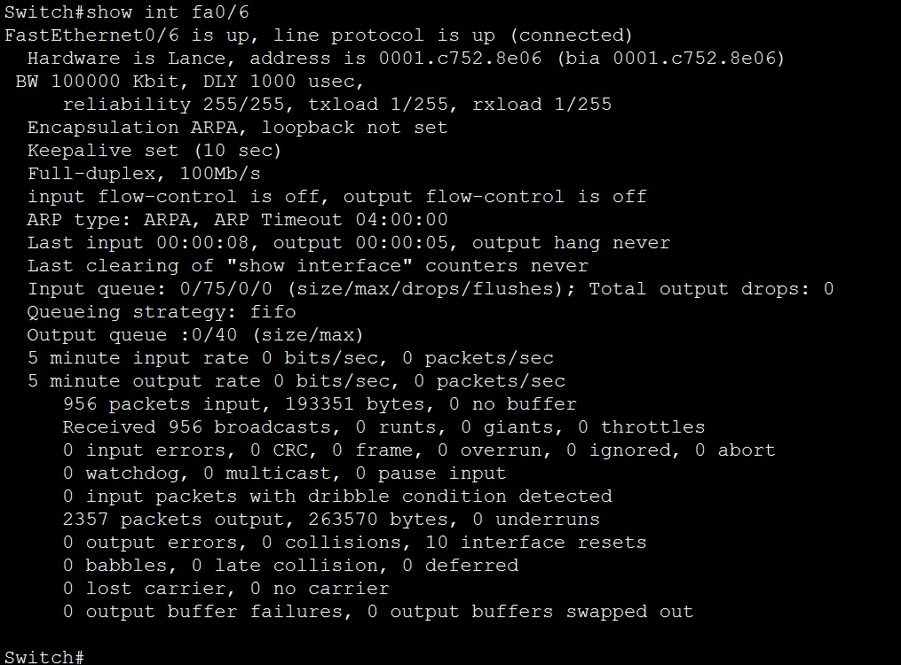

Проверим флеш память коммутатора: 

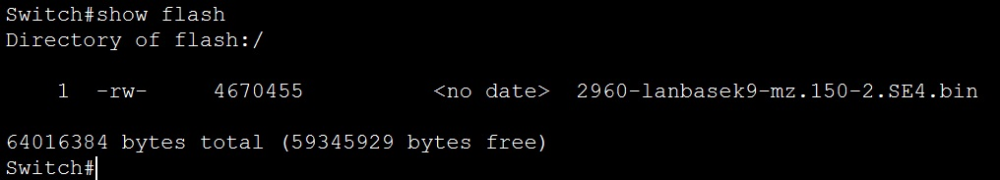

Перейдем в режим конфигурации, отключим интерпретацию команды как DNS имя, переименуем устройство, установим шифроку паролей, установим пароль на привилегированный режим и изменим приветственное сообщение: 

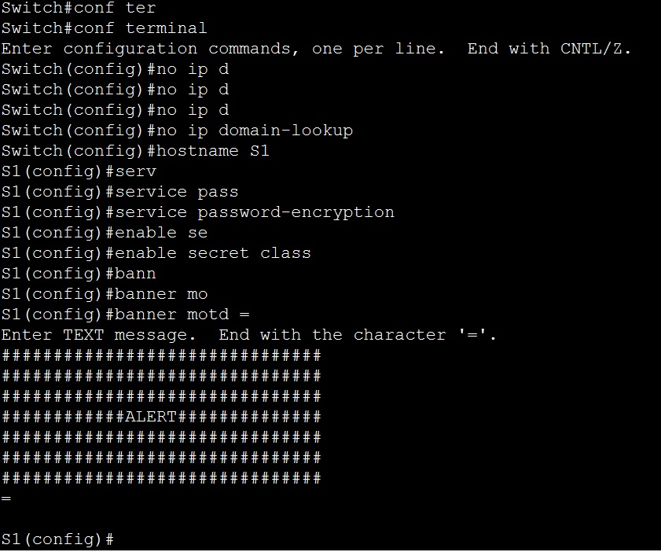

Назначим IP-адрес интерфейсу SVI на коммутаторе, установим пароль для доступа к устройству через консольный порт, настроим каналы виртуального соединения для подключения через Telnet и также установим на него пароль:

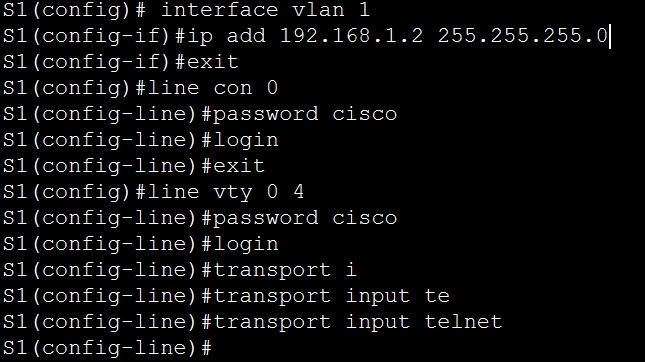

Чтобы консольные сообщения не прерывали выполнение команд, используем параметр logging synchronous:

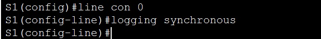

Назначим IP адрес нашему компьютеру: 

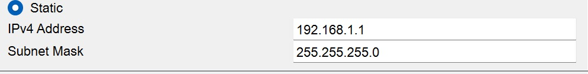

Включим SVI интерфейс: 

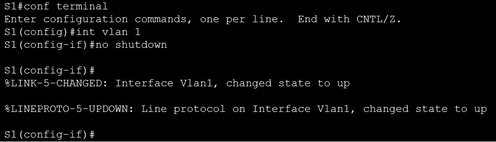

Подключимся к коммутатору через Telnet и проверим startup-config:

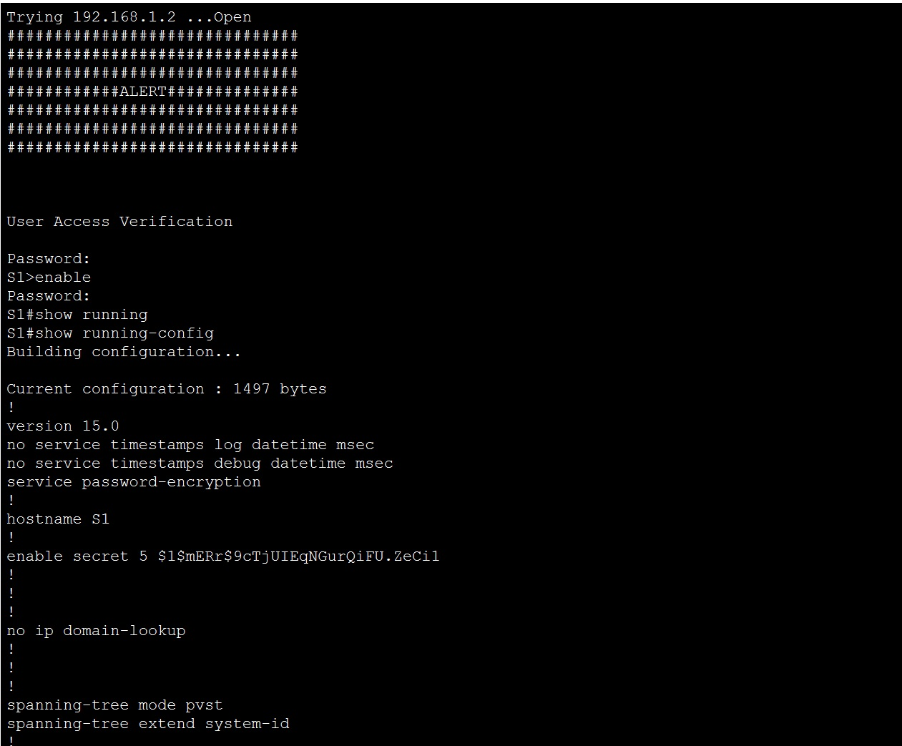

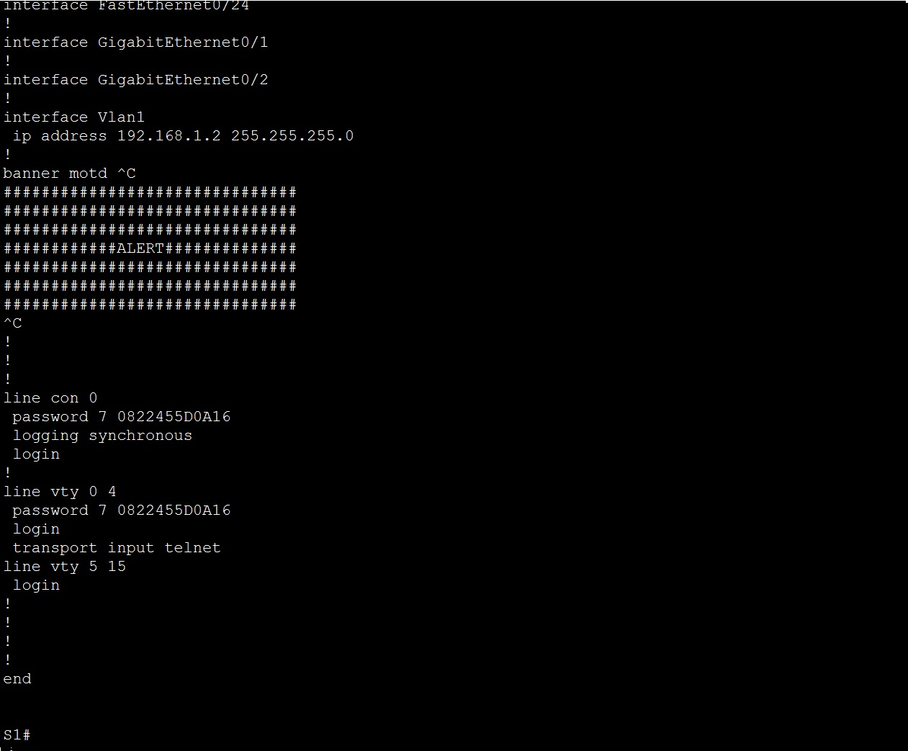

Пропингуем коммутатор через командную строку:

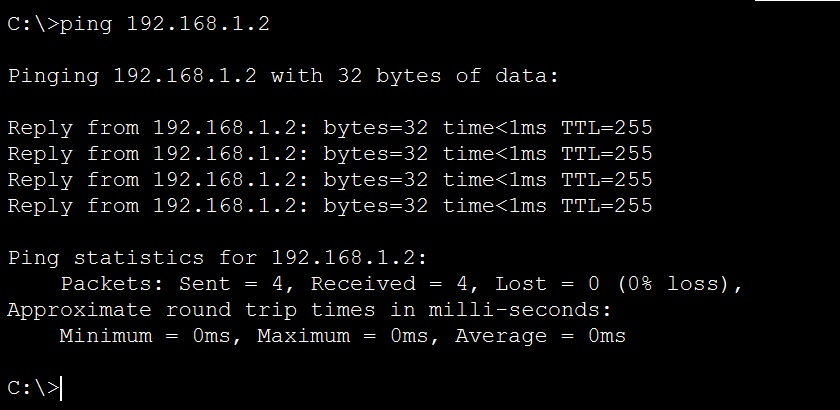

Сохраним наш running-config в startup-config и проверим его: 

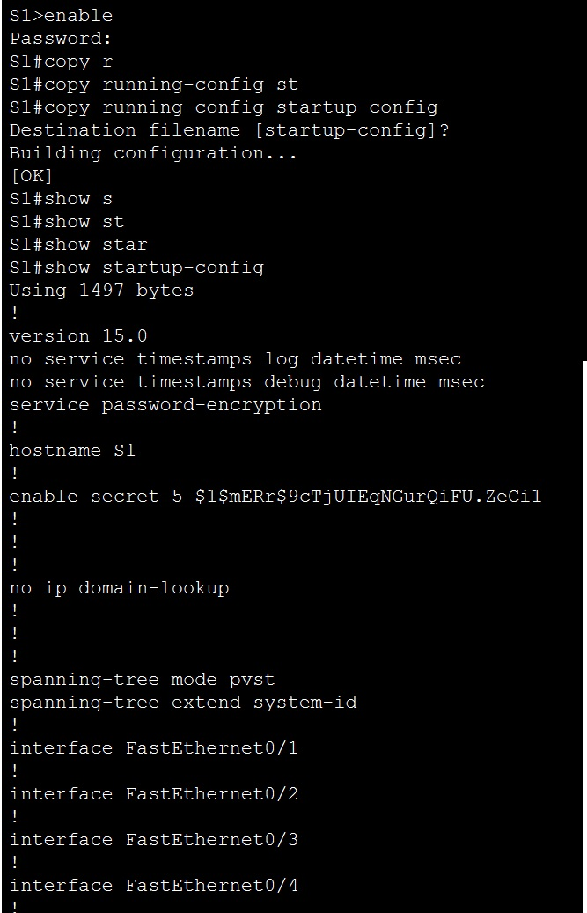 

