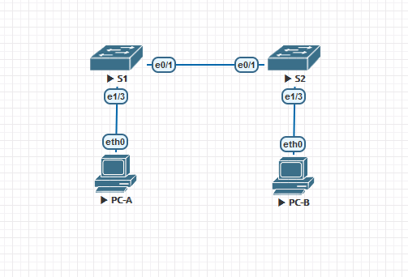
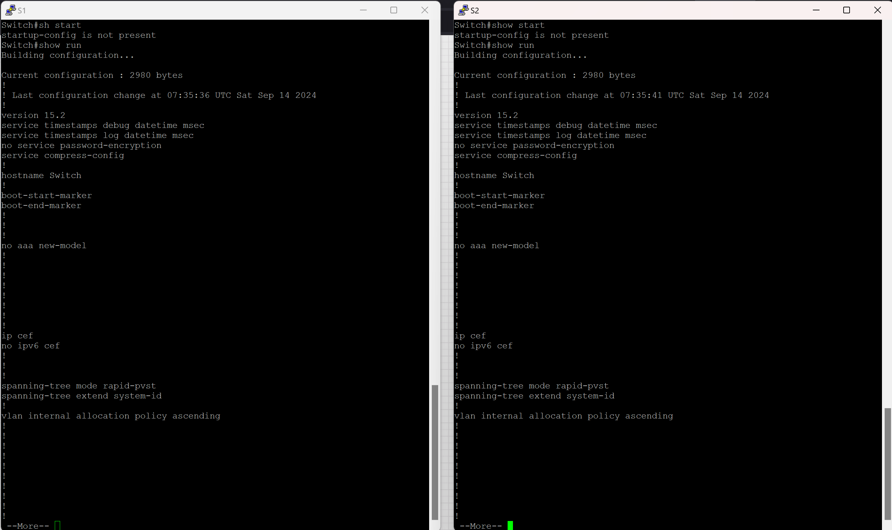
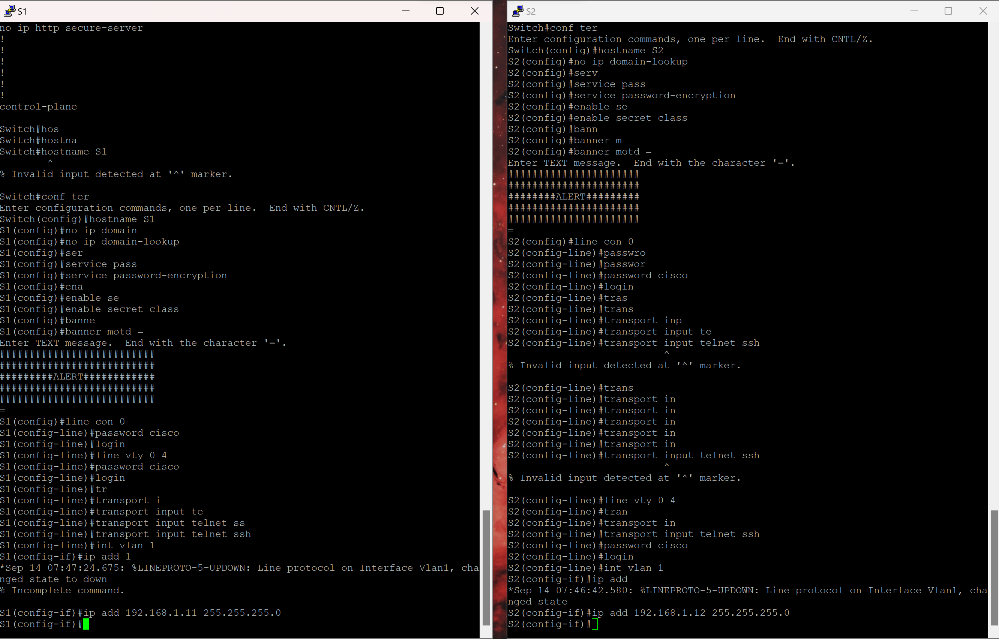
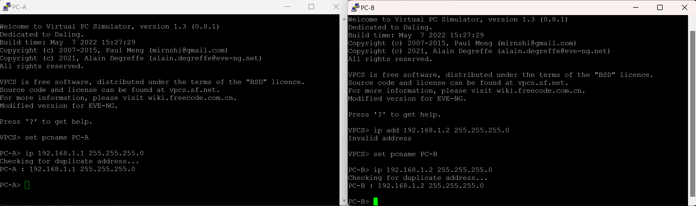
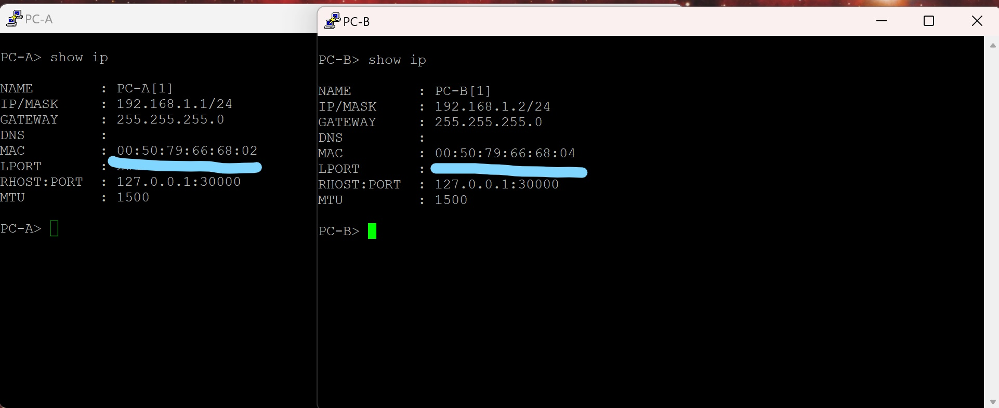

#  Лабораторная работа. Просмотр таблицы MAC-адресов коммутатора 

###  Задание:

+ Часть 1. Создание и настройка сети
  + Шаг 1. Подключите сеть в соответствии с топологией.
  + Шаг 2. Настройте узлы ПК.
  + Шаг 3. Выполните инициализацию и перезагрузку коммутаторов.
  + Шаг 4. Настройте базовые параметры каждого коммутатора.
	+ a. Настройте имена устройств в соответствии с топологией.
	+ b. Настройте IP-адреса, как указано в таблице адресации.
	+ c. Назначьте cisco в качестве паролей консоли и VTY.
	+ d. Назначьте class в качестве пароля доступа к привилегированному режиму EXEC.

+ Часть 2.Изучение таблицы МАС-адресов коммутатора
  Как только между сетевыми устройствами начинается передача данных, коммутатор выясняет МАС-адреса и строит таблицу.

### Топология:

### Таблица адресации:

|    Устройство    |   Интерфейс    |    IP-адрес/префикс      |
|-----------------:|:---------------|-------------------------:|
|       S1         |     VLAN 1     |    192.168.1.11/24       |
|       S2         |     VLAN 1     |    192.168.1.12/24       |
|       PC-A       |      NIC       |    192.168.1.1/24        |
|       PC-B       |      NIC       |    192.168.1.2/24        |

### Домашнее задание:

Убеждаемся в пустоте конфигов

Выполняем базовую настройку коммутаторов

Устанавливаем адреса на PC-A и PC-B

Узнаем MAC-адреса PC-A и PC-B

Узнаем MAC-адреса S1 и S2

Отрисуем MAC-таблицу на S2. За :6000 маком (порт e0/1) S1 коммутатор, за :6802 (e0/1) и :6804 (e1/4) наши компьютеры.

Выполним очистку MAC-таблицы и повторно отрисуем ее сразу

Через какое-то время в таблице появились MAC-адреса порта S1 коммутатора (через который подключен S2 свитч) и его SVI интерфейса VLAN 1

Попробуем проверить ARP-таблицу на PC-B. В моем случае она была пуста, но на реальном оборудовании устройства будут постоянно обмениваться кадрами и вероятно в таблице будут данные про порт e1/3,а после пинга S2 коммутатора и данные про его SVI VLAN 1.

Пропингуем все устройства с PC-B.

Проверим Arp-таблицу на S2. Появились данные про PC-B(:6804), PC-A(:6802), порт e0/1 S1 коммутатора(:6010) и его SVI  VLAN 1(:6000)

На PC-B также проверяем Arp-таблицу

