#  Лабораторная работа. Настройка IPv6-адресов на сетевых устройствах

###  Задание:

+ Часть 1. Часть 1. Настройка топологии и конфигурация основных параметров маршрутизатора и коммутатора
+ Часть 2. Ручная настройка IPv6-адресов
+ Часть 3. Проверка сквозного соединения

 ### Топология:

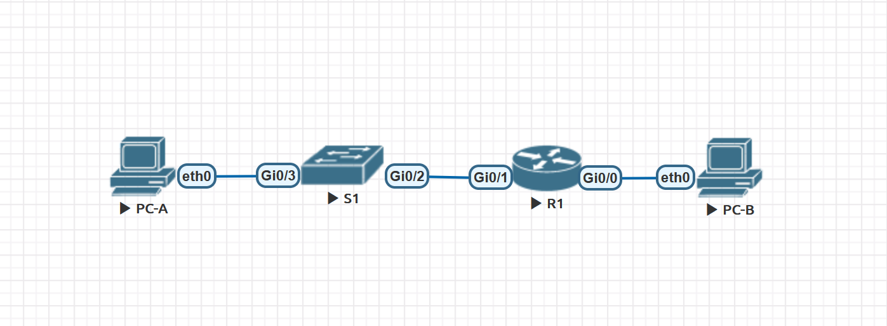

### Таблица адресации:

<table>
<tr>
<td>Устройство</td>
<td>Интерфейс</td>
<td>IP-адрес</td>
<td>Маска подсети</td>
<td>Шлюз по умолчанию</td>
</tr>
	<tr>
        <td rowspan="4">R1</td>
        <td>E0/1.10</td>
	  <td>192.168.10.1</td>
	  <td>255.255.255.0</td>
	  <td rowspan="4">-</td>
	</tr>
</table>

### Домашнее задание:

Подключимся к коммутатору, перейдем в привилегированный режим и убедимся, что на коммутаторе находится пустой файл конфигурации (startup-config) по умолчанию.

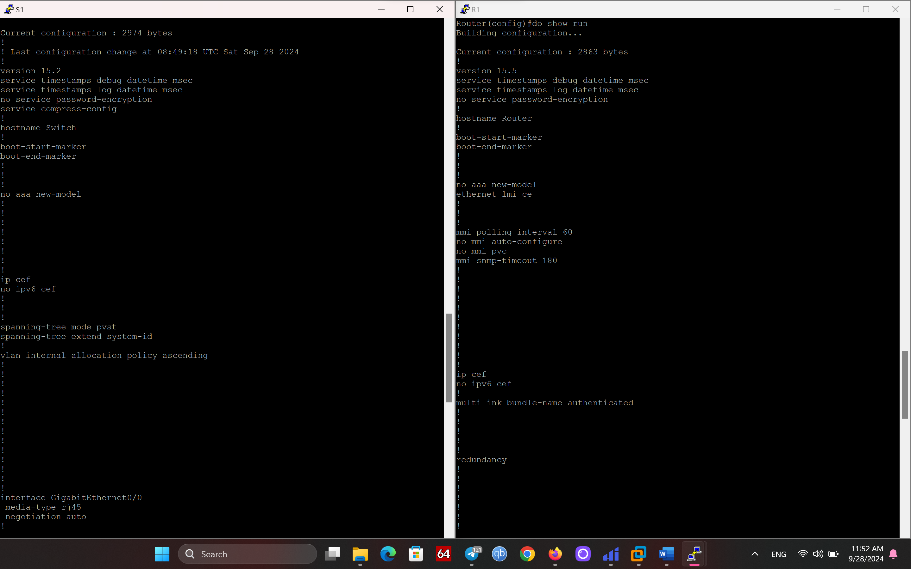

Выполним базовую конфигурацию (в моем случае, коммутатор выдавал ошибку на комманду <code>show sdm prefer</code>).

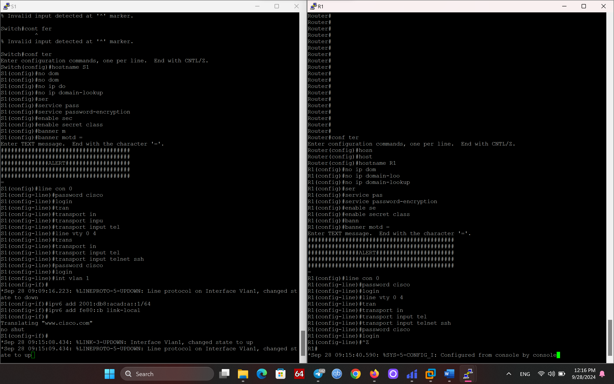

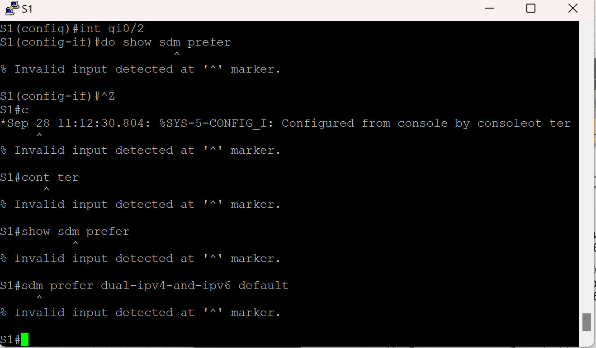

Назначим глобальные и локальные ipv6-адреса на порты R1.

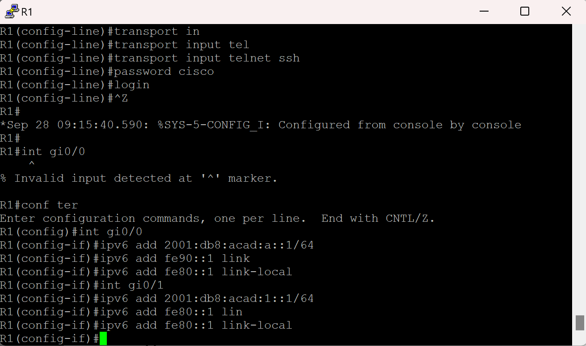

Проверим глобальные и локальные адреса на наших интефейсках маршрутизатора.

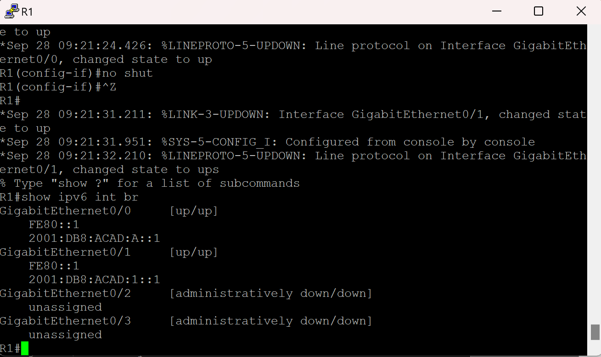

Скриншот был сделан уже после включения ipv6 роутинга, поэтому интерфейсы маршрутизатора находятся в группе FE80::2(группа для маршрутизаторов работающих с ipv6).

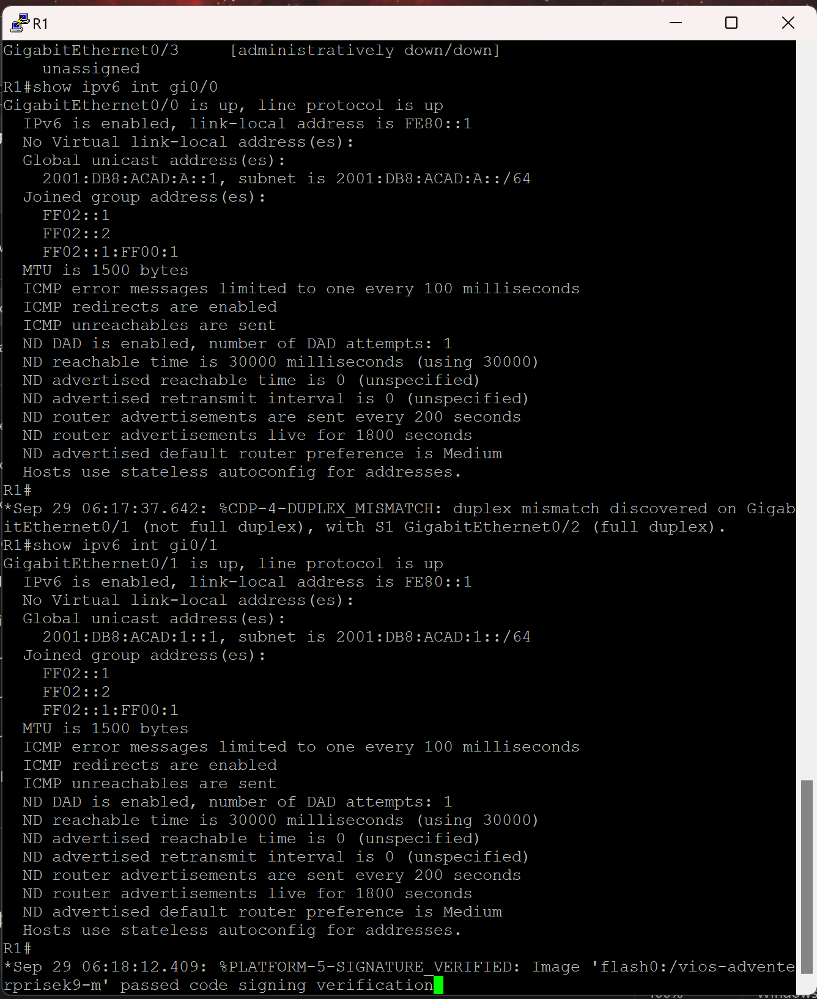

Посмотрим на настройки наших PC.

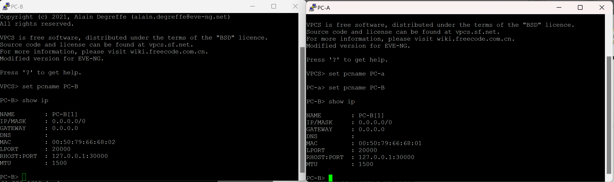

Активируем ipv6-маршрутизацию на R1 маршрутизаторе.

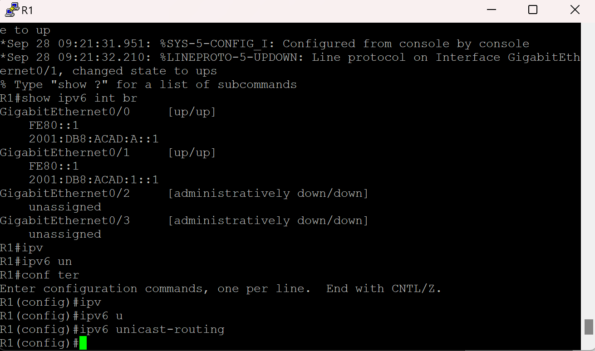

Снова проверим настройки наших PC и убедимся в исправной работе SLAAC.

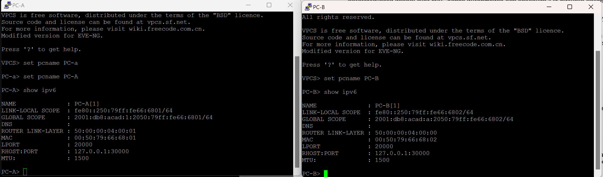

Проверим SVI интерфейс коммутатора S1.

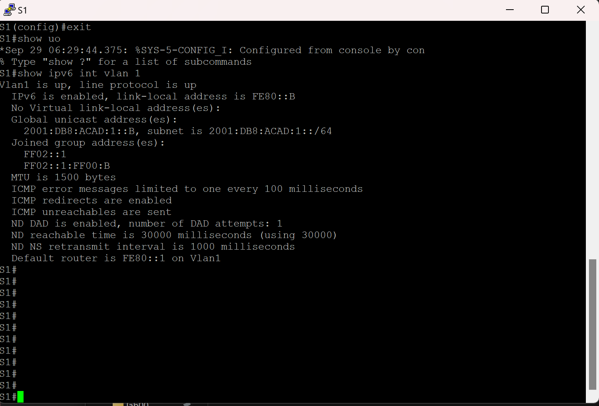

Назначим нашим компьютерам ipv6 адреса. В моем случае адрес, полученный через SLAAC, был перезаписан, но ipv6 устройства могут иметь сколько угодно глобальных адресов.

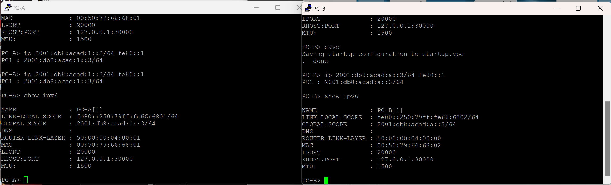

Пробуем сделать эхо-запрос с PC-A на локальные адреса устройств локальной среды.

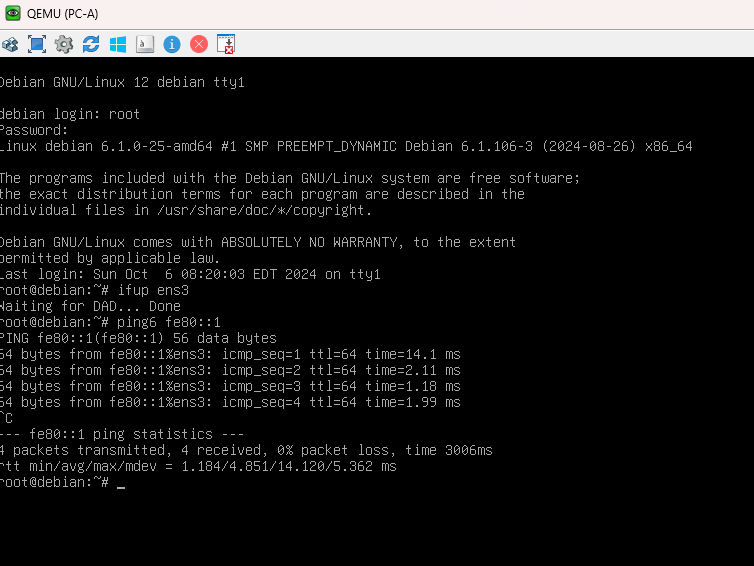

Пропингуем VLAN 1 S1 и не получим ответа тк. не прописал маршрут.

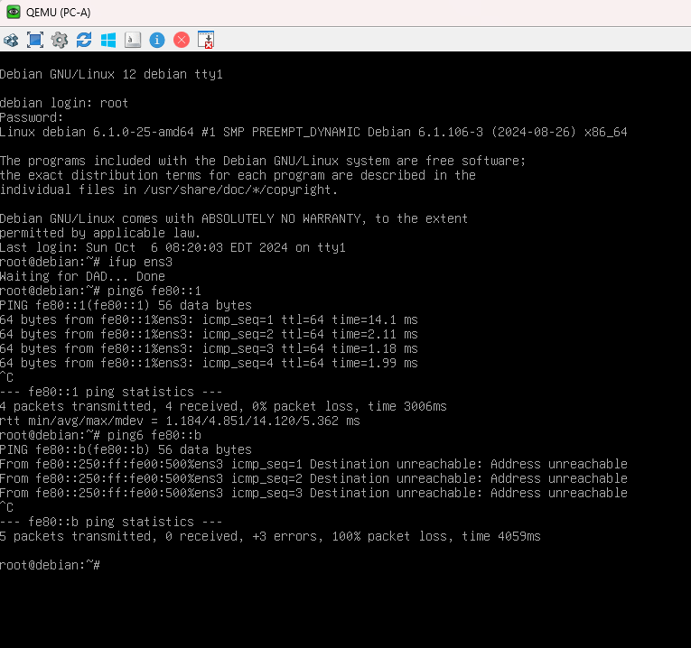

Выполним команду tracert на PC-A, чтобы проверить наличие сквозного подключения к PC-B.

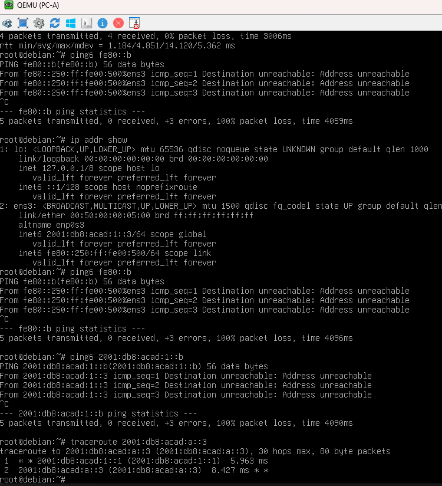

Выполним пинг с PC-B на PC-A

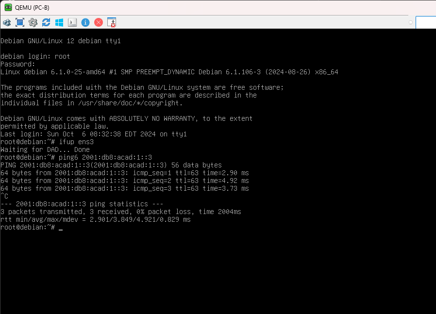

Выполним пинг с PC-B на локальный адрес маршрутизатора

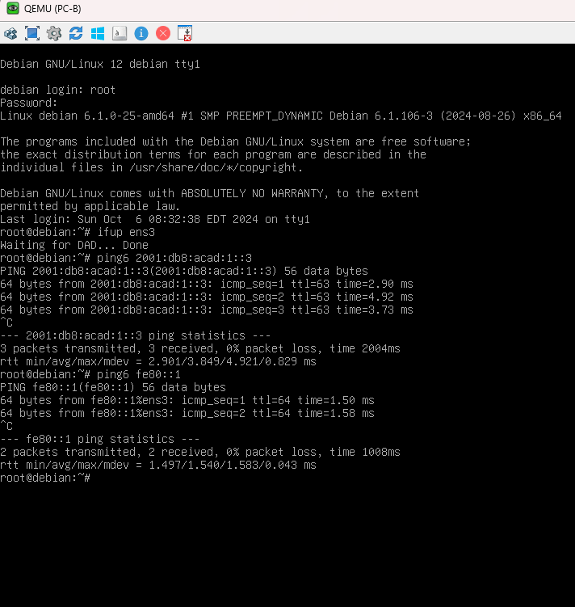

