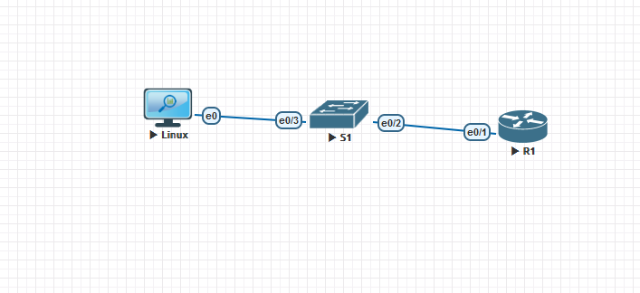

#  Лабораторная работа. Настройка IPv6-адресов на сетевых устройствах

###  Задание:

+ Часть 1. Настройка основных параметров устройства
+ Часть 2. Настройка маршрутизатора для доступа по протоколу SSH
+ Часть 3. Настройка коммутатора для доступа по протоколу SSH
+ Часть 4. SSH через интерфейс командной строки (CLI) коммутатора

### Топология:

### Таблица адресации:

<table>
<tr>
<td>Устройство</td>
<td>Интерфейс</td>
<td>ip-адрес</td>
<td>Маска подсети</td>
<td>Шлюз по умолчанию</td>
</tr>
 <tr>
        <td>R1</td>
        <td>G0/0</td>
		<td>2001:db8:acad:a::1</td>
		<td>fe80::1</td>
		<td>64</td>
		<td>-</td>
    </tr>
	<tr>
        <td>G0/1</td>
        <td>2001:db8:acad:1::1 </td>
		<td>fe80::1</td>
		<td>64</td>
		<td>-</td>
    </tr>
		<tr>
        <td>S1</td>
        <td>VLAN 1</td>
		<td>2001:db8:acad:1::b</td>
		<td>fe80::b</td>
		<td>64</td>
		<td>-</td>
    </tr>
	<tr>
        <td>PC-A</td>
        <td>NIC</td>
		<td>2001:db8:acad:1::3</td>
		<td>SLACC</td>
		<td>64</td>
		<td>fe80::1</td>
    </tr>
	<tr>
        <td>PC-B</td>
        <td>NIC</td>
		<td>2001:db8:acad:a::3</td>
		<td>SLACC</td>
		<td>64</td>
		<td>fe80::1</td>
    </tr>
</table>