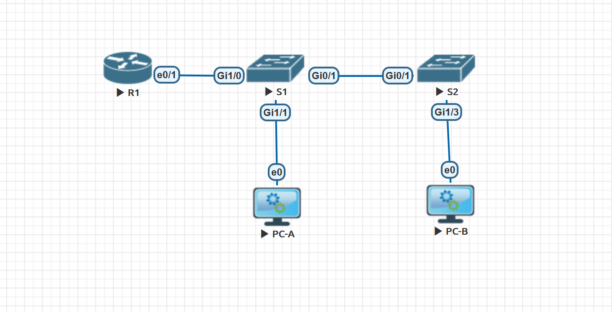

#  Лабораторная работа. Настройка IPv6-адресов на сетевых устройствах

###  Задание:

+ Часть 1. Часть 1. Настройка топологии и конфигурация основных параметров маршрутизатора и коммутатора
+ Часть 2. Ручная настройка IPv6-адресов
+ Часть 3. Проверка сквозного соединения

 ### Топология:

### Таблица адресации:

<table>
<tr>
<td>Устройство</td>
<td>Интерфейс</td>
<td>IP-адрес</td>
<td>Маска подсети</td>
<td>Шлюз по умолчанию</td>
</tr>
	<tr>
        <td rowspan="4">R1</td>
        <td>E0/1.10</td>
	  <td>192.168.10.1</td>
	  <td>255.255.255.0</td>
	  <td rowspan="4">-</td>
	</tr>
<tr>
        <td>E0/1.20</td>
	  <td>192.168.20.1</td>
	  <td>255.255.255.0</td>
</tr>

<tr>
        <td>E0/1.30</td>
	  <td>192.168.30.1</td>
	  <td>255.255.255.0</td>
</tr>

<tr>
        <td>E0/1.1000</td>
	  <td>-</td>
	  <td>-</td>
</tr>

</table>