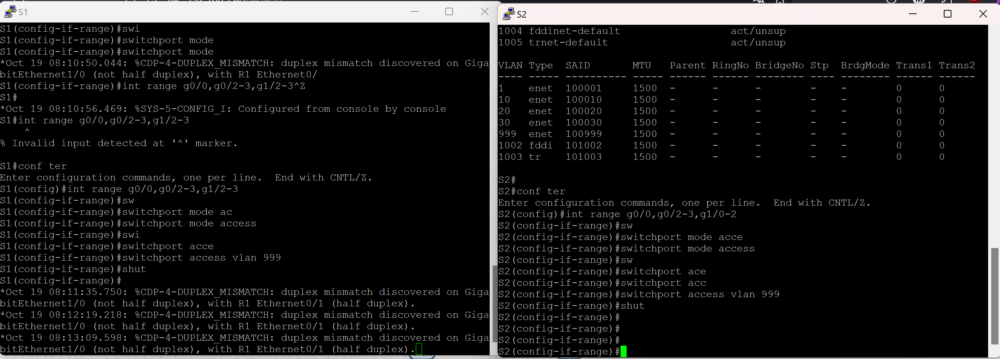
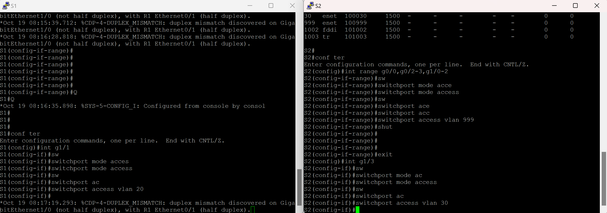

#  Лабораторная работа - Внедрение маршрутизации между виртуальными локальными сетями

###  Задание:

+Часть 1. Создание сети и настройка основных параметров устройства
+Часть 2. Создание сетей VLAN и назначение портов коммутатора
+Часть 3. Настройка транка 802.1Q между коммутаторами.
+Часть 4. Настройка маршрутизации между сетями VLAN
+Часть 5. Проверка, что маршрутизация между VLAN работает

### Топология:

### Таблица адресации:

<table>

<tr>
	<td>Устройство</td>
	<td>Интерфейс</td>
	<td>IP-адрес</td>
	<td>Маска подсети</td>
	<td>Шлюз по умолчанию</td>
</tr>

<tr>
        <td rowspan="4">R1</td>
        <td>E0/1.10</td>
	  <td>192.168.10.1</td>
	  <td>255.255.255.0</td>
	  <td rowspan="4">-</td>
</tr>

<tr>
        <td>E0/1.20</td>
	  <td>192.168.20.1</td>
	  <td>255.255.255.0</td>
</tr>

<tr>
        <td>E0/1.30</td>
	  <td>192.168.30.1</td>
	  <td>255.255.255.0</td>
</tr>

<tr>
        <td>E0/1.1000</td>
	  <td>-</td>
	  <td>-</td>
</tr>

<tr>
        <td>S1</td>
        <td>VLAN 10</td>
	  <td>192.168.10.11</td>
	  <td>255.255.255.0</td>
	  <td>192.168.10.1</td>
</tr>

<tr>
        <td>S2</td>
        <td>VLAN 10</td>
	  <td>192.168.10.12</td>
	  <td>255.255.255.0</td>
	  <td>192.168.10.1</td>
</tr>

<tr>
        <td>PC-A</td>
        <td>NIC</td>
	  <td>192.168.20.3</td>
	  <td>255.255.255.0</td>
	  <td>192.168.20.1</td>
</tr>

<tr>
        <td>PC-B</td>
        <td>NIC</td>
	  <td>192.168.30.3</td>
	  <td>255.255.255.0</td>
	  <td>192.168.30.1</td>
</tr>

</table>

### Таблица VLAN:

<table>

<tr>
	<td>VLAN</td>
	<td>Иия</td>
	<td>Назначенный интерфейс</td>
</tr>

<tr>
	<td>10</td>
	<td>managment</td>
	<td>S1: VLAN 10 S2: VLAN 10</td>
</tr>

<tr>
      <td>20</td>
	<td>sales</td>
	<td>S1: g1/1</td>
</tr>

<tr>
	<td>30</td>
	<td>operations</td>
	<td>S2: g1/3</td>
</tr>

<tr>
	<td>999</td>
	<td>parking_lot</td>
	<td>S1: g0/0-3, g1/2-3 S2: g0/0-3, g1/0-2</td>
</tr>

</table>

### Домашнее задание:

Проверим стартовые конфиги устройств

Выполним базовую настройку маршрутизатора и зададим время

Выполним базовую настройку коммутаторов и также зададим им время

Зададим узлам ip-адреса

Создадим VLAN'ы на коммутаторах и назначим им имена

Создадим SVI интерфейсы на коммутаторах и укажем шлюз по умолчанию

Установим неиспользуемые порты в режим доступа, назначим им 999 vlan и выключим их

Назначим нужным портам режим доступа и определеим им VLAN

Проверим таблицу VLAN'ов

Назначим на портах коммутаторах g0/1 режим trunk, зададим native vlan 1000 и разрежим работу с VLAN'ами 10,20,30,1000

Проверим настройки этих транк-портов

Назначим на S1 порт g1/0 в режим транка

Проверим его настройки

Сохраним настройки на коммутаторах

Настроим саб-интерфейсы на маршрутизаторе R1

Проверим интерфейсы маршрутизатора (порт включил раньше, возможно не попало в скриншоты)

Пропингуем шлюзы на хостах и с PC-A выполним пинг на PC-B

Также пропингуем SVI интерфейсы коммутаторов с PC-A (я маршрутизацию маршрутизацию на коммутаторах , но не помню когда "ip route 0.0.0.0 0.0.0.0 192.168.10.1")

 

Выполним traceroute с PC-B до PC-A

Первым в списке видим шлюз за 30 Vlan(30.1), и вторым 20.3 ип хоста PC-A 

