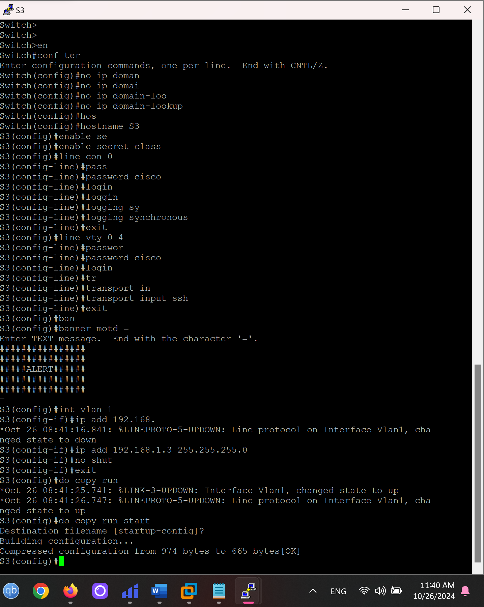

#  Лабораторная работа. Развертывание коммутируемой сети с резервными каналами

###  Задание:

+ Часть 1. Создание сети и настройка основных параметров устройства
+ Часть 2. Выбор корневого моста
+ Часть 3. Наблюдение за процессом выбора протоколом STP порта, исходя из стоимости портов
+ Часть 4. Наблюдение за процессом выбора протоколом STP порта, исходя из приоритета портов

### Топология:

### Таблица адресации:

<table>

<tr>
	<td>Устройство</td>
	<td>Интерфейс</td>
	<td>IP-адрес</td>
	<td>Маска подсети</td>
</tr>

<tr>
        <td>S1</td>
        <td>VLAN 1</td>
	  <td>192.168.1.1</td>
	  <td>255.255.255.0</td>
</tr>

<tr>
        <td>S2</td>
        <td>VLAN 1</td>
	  <td>192.168.1.2</td>
	  <td>255.255.255.0</td>
</tr>

<tr>
        <td>S3</td>
        <td>VLAN 1</td>
	  <td>192.168.1.3</td>
	  <td>255.255.255.0</td>
</tr>

</table>

### Домашнее задание:

Проверим стартовые конфиги устройств.

Выполним перезагрузку коммутаторов.

Выполним базовую настройку коммутаторов.

Проверим доступность устройств в сети.

Выключим все порты на коммутаторах.

Всем подключенным портам установим режим транка, разрешим коммутацию 1 и 10 вланов и установим найтив влан 10.

Включим, указанные в лабораторной работе, порты.

Выполним комманду show spanning-tree на всех коммутаторах.

Укажем роли и статусы активным портов.

Какой коммутатор является корневым мостом? 

Ответ: S1

Почему этот коммутатор был выбран протоколом spanning-tree в качестве корневого моста?

Ответ: Рут коммутатором становится то устройство, у которого самая лучшая BPDU (BID в ней). В нашем случае у всех одинаковый приоритет(32769), поэтому будет выбираться по самому маленькому MAC-адресу

Какие порты на коммутаторе являются корневыми портами? 

Ответ: Те, которые иметь дешевле путь до рут коммутатора и будут смотреть в его сторону или иметь меньший порт ид.

Какие порты на коммутаторе являются назначенными портами? 

Ответ: Порт имеет роль Des если он является кратчайшим путем до root коммутатора, это зависит от стоймости порта, BID и port id(S1: все порты будут des тк это рут коммутатор, S2:e0/3, S3: в теории, e0/1 мог бы быть des портом, но тк у S2 порта лучший bid или port id(в данном случае port id) он является alt, а на свиче S2 e0/3 является des).

Какой порт отображается в качестве альтернативного и в настоящее время заблокирован?

Ответ: S3: e0/1

Почему протокол spanning-tree выбрал этот порт в качестве невыделенного (заблокированного) порта?

Ответ: В данном случае, из-за большего port id (prio nbr).

Выполним show span на не рут устройствах.

Поменяем стоимость рут порта на S3 и сделаем наш заблокированный порт des.

Почему протокол spanning-tree заменяет ранее заблокированный порт на назначенный порт и блокирует порт, который был назначенным портом на другом коммутаторе?

Ответ: Потому что у S3 стоимость пути до корневого коммутатора стала меньше, чем у S2. 

Отменим прошлые настройки.

Включим все порты.

Проверим состояние STP на коммутаторах.

Какой порт выбран протоколом STP в качестве порта корневого моста на каждом коммутаторе некорневого моста? 

Ответ: S2 e0/0 тк у него самый низкий приоритет порта(prio nbr), S3: e0/2 тк у e0/3 больше приоритет порта.

Почему протокол STP выбрал эти порты в качестве портов корневого моста на этих коммутаторах?

Ответ: У них был ниже приоритет порта, чем у остальных.