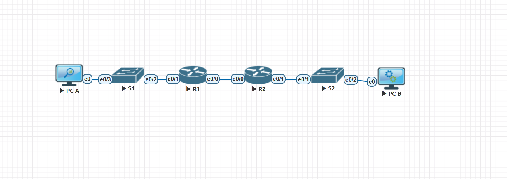

# Лабораторная работа - Реализация DHCPv4 

###  Задание:

+ Часть 1. Создание сети и настройка основных параметров устройства
+ Часть 2. Настройка и проверка двух серверов DHCPv4 на R1
+ Часть 3. Настройка и проверка DHCP-ретрансляции на R2

### Топология:

### Таблица адресации:

<table>

<tr>
	<td>Устройство</td>
	<td>Интерфейс</td>
	<td>IP-адрес</td>
	<td>Маска подсети</td>
	<td>Шлюз по умолчанию</td>
</tr>

<tr>
        <td rowspan="5">R1</td>
        <td>E0/0</td>
	  <td>10.0.0.1</td>
	  <td>255.255.255.252</td>
	  <td rowspan="5">-</td>
</tr>

<tr>
        <td>E0/1</td>
	  <td>-</td>
	  <td>-</td>
</tr>

<tr>
        <td>E0/1.100</td>
	  <td>192.168.100.1-62</td>
	  <td>255.255.255.192</td>
</tr>

<tr>
        <td>E0/1.200</td>
	  <td>192.168.200.1-30</td>
	  <td>255.255.255.224</td>
</tr>

<tr>
        <td>E0/1.1000</td>
	  <td>-</td>
	  <td>-</td>
</tr>

<tr>
        <td rowspan="2">R2</td>
        <td>E0/0</td>
	  <td>10.0.0.2</td>
	  <td>255.255.255.252</td>
	  <td rowspan="2">-</td>
</tr>

<tr>
        <td>E0/1</td>
	  <td>192.168.1.1-14</td>
	  <td>255.255.255.240</td>
</tr>

<tr>
        <td>S1</td>
        <td>VLAN 200</td>
	  <td>192.168.200.2</td>
	  <td>255.255.255.224</td>
	  <td>192.168.200.1</td>
</tr>

<tr>
        <td>S2</td>
        <td>VLAN 1</td>
	  <td></td>
	  <td></td>
	  <td></td>
</tr>

<tr>
        <td>PC-A</td>
        <td>NIC</td>
	  <td>DHCP</td>
	  <td>DCHP</td>
	  <td>DHCP</td>
</tr>

<tr>
        <td>PC-B</td>
        <td>NIC</td>
	  <td>DHCP</td>
	  <td>DHCP</td>
	  <td>DHCP</td>
</tr>

</table>

### Таблица VLAN:

<table>

<tr>
	<td>VLAN</td>
	<td>Иия</td>
	<td>Назначенный интерфейс</td>
</tr>

<tr>
	<td>1</td>
	<td>no</td>
	<td>S2: F0/18</td>
</tr>

<tr>
      <td>100</td>
	<td>clients</td>
	<td>S1: F0/6</td>
</tr>

<tr>
	<td>200</td>
	<td>managment</td>
	<td>S1: VLAN 200</td>
</tr>

<tr>
	<td>999</td>
	<td>parking_lot</td>
	<td>S1: F0/1-4, F0/7-24, G0/1-2</td>
</tr>

<tr>
	<td>1000</td>
	<td>Native</td>
	<td>-</td>
</tr>

</table>