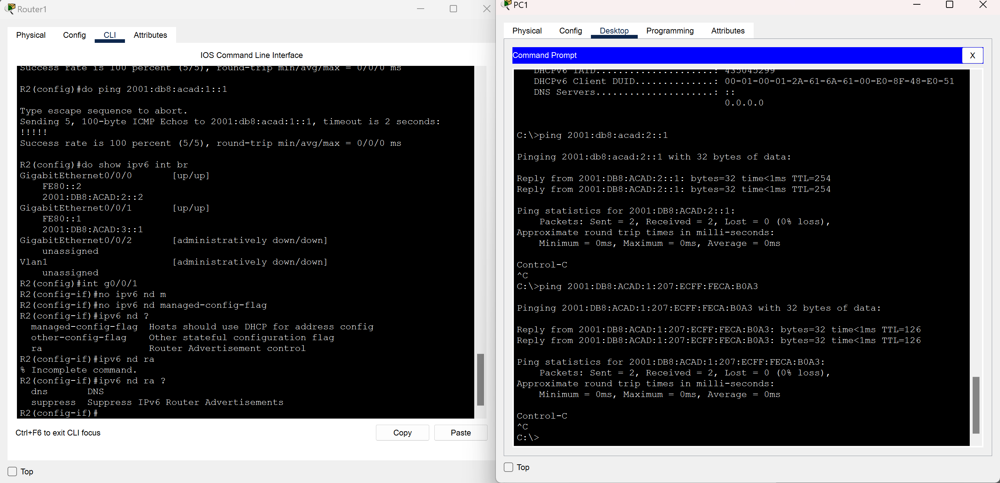

# Лабраторная работа - Настройка DHCPv6

###  Задание:

+ Часть 1. Создание сети и настройка основных параметров устройства
+ Часть 2. Проверка назначения адреса SLAAC от R1
+ Часть 3. Настройка и проверка сервера DHCPv6 без гражданства на R1
+ Часть 4. Настройка и проверка состояния DHCPv6 сервера на R1
+ Часть 5. Настройка и проверка DHCPv6 Relay на R2

### Топология:

### Таблица адресации:

<table>

<tr>
	<td>Устройство</td>
	<td>Интерфейс</td>
	<td>IPv6-адрес</td>
</tr>

<tr>
        <td rowspan="4">R1</td>
        <td rowspan="2">E0/0</td>
	 <td>2001:db8:acad:2::1/64</td>
</tr>

<tr>
	 <td>fe80::1</td>
</tr>

<tr>
        <td rowspan="2">E0/1</td>
	 <td>2001:db8:acad:1::1/64</td>
</tr>

<tr>
	 <td>fe80::1</td>
</tr>

<tr>
        <td rowspan="4">R1</td>
        <td rowspan="2">E0/0</td>
	 <td>2001:db8:acad:2::2/64</td>
</tr>

<tr>
	 <td>fe80::2</td>
</tr>

<tr>
        <td rowspan="2">E0/1</td>
	 <td>2001:db8:acad:3::1/64</td>
</tr>

<tr>
	 <td>fe80::1</td>
</tr>

<tr>
        <td>PC-A</td>
        <td>NIC</td>
	 <td>DHCP</td>
</tr>

<tr>
        <td>PC-B</td>
        <td>NIC</td>
	 <td>DHCP</td>
</tr>

</table>

### Домашнее задание:

Выполним базовую настройку коммутаторов

Выполним  базовую настройку маршрутизаторов

Настроим порты, статическую маршрутизацию и пропингуем их

Получим адрес по SLAAC на PC-A

Создадим dchp пул, пропишем ему настройки, на интерфейсе e0/1 укажем в пакете RA флаг О на 1 и прикрепим к интерфейсу новый пул.

Попробуем получить ip от slacc и dns от dhcp, также пропингуем порт g0/0/1 на R2

Создадим новый пул для сети за R2 g0/0/1 и сделаем его statefull

Проверим сетевые настройки PC-B и убедимся, что он их получает по SLAAC

Cpt не поддерживает dhcp relay

Отключим M флаг, снова получим на PC-B конфигурацию от SLAAC и пропингуем порты R1 g0/0/0 и PC-A

