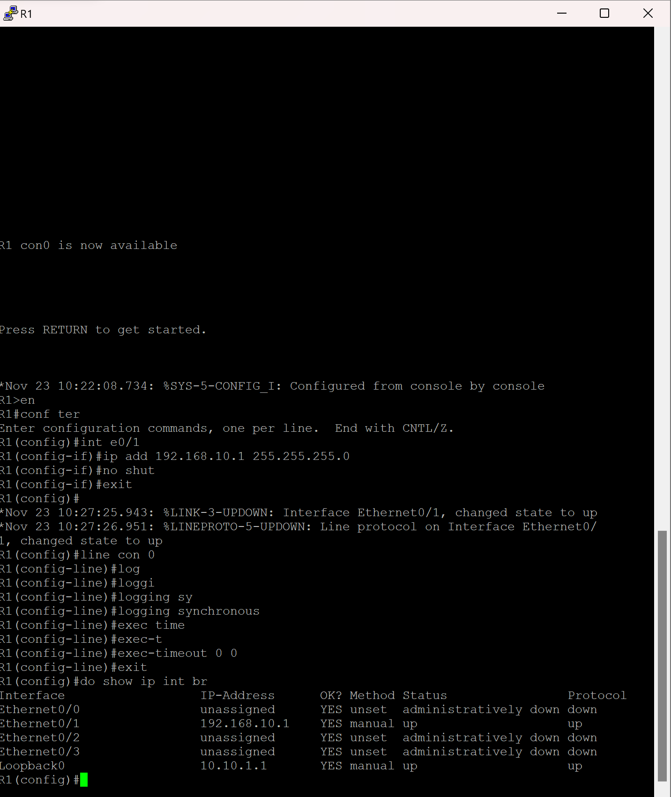
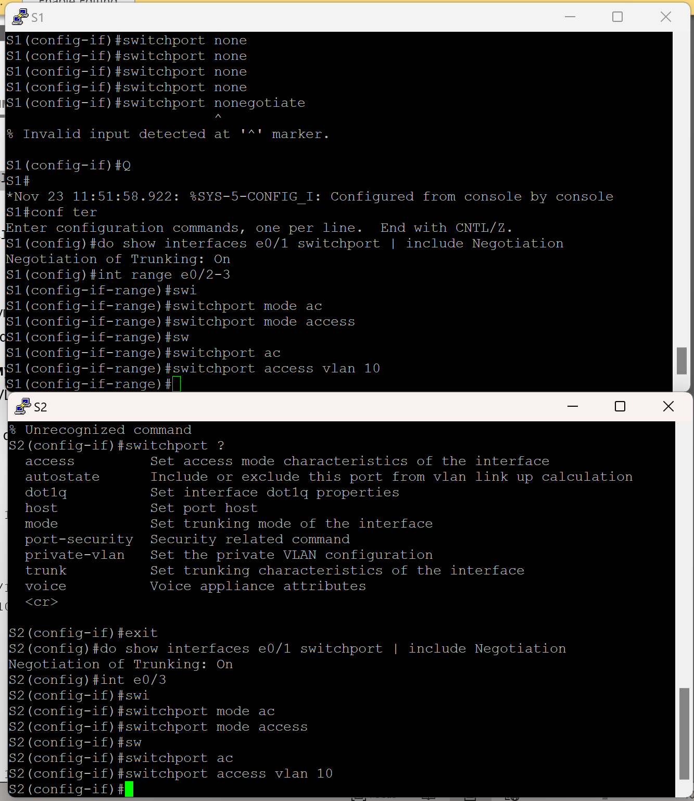
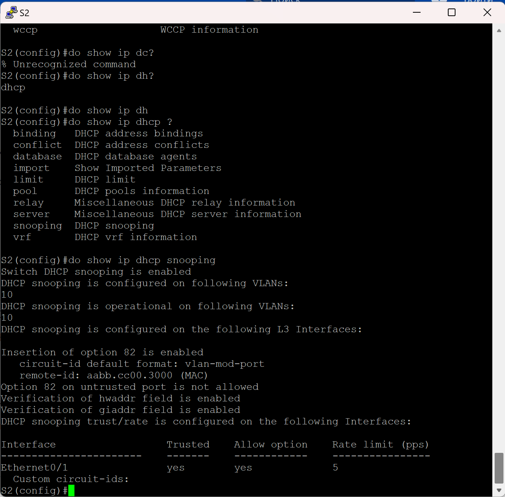

#  Лабораторная работа - Конфигурация безопасности коммутатора 

###  Задание:

+ Часть 1. Настройка основного сетевого устройства
  	+ Создайте сеть.
	+ Настройте маршрутизатор R1.
	+ Настройка и проверка основных параметров коммутатора

+ Часть 2. Настройка сетей VLAN
 	+ Сконфигруриуйте VLAN 10.
	+ Сконфигруриуйте SVI для VLAN 10.
	+ Настройте VLAN 333 с именем Native на S1 и S2.
	+ Настройте VLAN 999 с именем ParkingLot на S1 и S2.

+ Часть 3. Настройки безопасности коммутатора.

	+ Реализация магистральных соединений 802.1Q.
	+ Настройка портов доступа
	+ Безопасность неиспользуемых портов коммутатора
	+ Документирование и реализация функций безопасности порта.
	+ Реализовать безопасность DHCP snooping .
	+ Реализация PortFast и BPDU Guard
	+ Проверка сквозной связанности.

### Топология:

### Таблица адресации:

<table>

<tr>
	<td>Устройство</td>
	<td>interface/vlan</td>
	<td>IP-адрес</td>
	<td>Маска подсети</td>
</tr>

<tr>
        <td rowspan="2">R1</td>
        <td>E0/1</td>
	  <td>192.168.10.1</td>
	  <td>255.255.255.0</td>
</tr>

<tr>
        <td>Loopback 0</td>
	  <td>10.10.1.1</td>
	  <td>255.255.255.0</td>
</tr>

<tr>
        <td>S1</td>
        <td>VLAN 10</td>
	  <td>192.168.10.201</td>
	  <td>255.255.255.0</td>
</tr>

<tr>
        <td>S2</td>
        <td>VLAN 10</td>
	  <td>192.168.10.202</td>
	  <td>255.255.255.0</td>
</tr>

<tr>
        <td>PC A</td>
        <td>NIC</td>
	  <td>DHCP</td>
	  <td>255.255.255.0</td>
</tr>

<tr>
        <td>PC B</td>
        <td>NIC</td>
  	  <td>DHCP</td>
	  <td>255.255.255.0</td>
</tr>

</table>

### Домашнее задание:

Перенесем конфиг в R1

Выполним базову настройку коммутаторов и создадим svi интерфейсы

Создадим 333 999 vlan'ы на коммутаторах 

Настроим транк порты на коммутаторах

Проверим настройки транк портов

Пробуем отключить DTP, но у меня такой команды нет

Переведем порты в режим доступа

Перенесем неиспользуемые порты в 999 влан и отключим их

Проверим статус интерфейсов

Добавим описание для портов

Выполним команду port-security для интерфейса e0/2 на S1

Заполним таблицу ответов

Настроим port-security для e0/2

Отключим port-security aging static и проверим статус port-security на e0/2

Настроим port-security на e0/3 S2

Посмотрим его настройки

Получим адрес на PC-B и проверим наш порт

Настроим dchp snooping на S2

Проверим его настройки 

Обновим ип адреесс на PC-B и проверим таблицу привязанностей на порту

Настроим portfast на портах

Включим bpduguard на портах доступа

Проверим , что настройки встали

Проринугуем устройства с хостов

