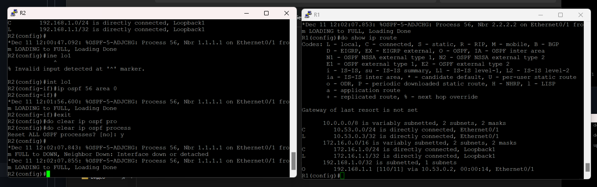
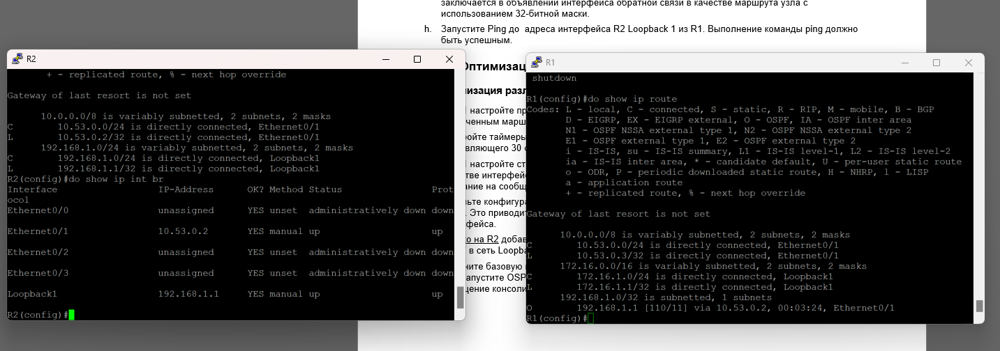
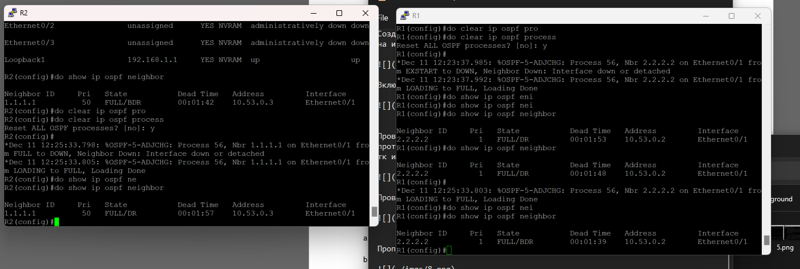
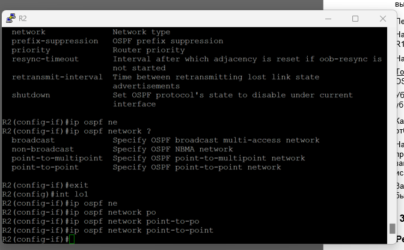

#  Лабораторная работа. Настройка протокола OSPFv2 для одной области

###  Задание:

+ Часть 1. Создание сети и настройка основных параметров устройства
+ Часть 2. Настройка и проверка базовой работы протокола  OSPFv2 для одной области
+ Часть 3. Оптимизация и проверка конфигурации OSPFv2 для одной области

### Топология:

### Таблица адресации:

<table>

<tr>
	<td>Устройство</td>
	<td>interface/vlan</td>
	<td>IP-адрес</td>
	<td>Маска подсети</td>
</tr>

<tr>
        <td rowspan="2">R1</td>
        <td>E0/1</td>
	  <td>10.53.0.3</td>
	  <td>255.255.255.0</td>
</tr>

<tr>
        <td>Loopback 1</td>
	  <td>172.16.1.1</td>
	  <td>255.255.255.0</td>
</tr>

<tr>
        <td rowspan="2">R2</td>
        <td>E0/1</td>
	  <td>10.53.0.2</td>
	  <td>255.255.255.0</td>
</tr>

<tr>
        <td>Loopback 1</td>
	  <td>192.168.1.1</td>
	  <td>255.255.255.0</td>
</tr>

</table>

### Домашнее задание:

Выполним базовую конфигурацию маршрутизаторов

Выполним базовую конфигурацию коммутаторов

Настроим интерфейсы на маршрутизаторах 

Создадим экземпляр OSPF на маршрутизаторах, назначим им ид и включим OSPF на интерфейсах

Включим ospf на lo1 R2

Просмотрим таблицу соседей ospf и убедимся, что R2 стал DR тк его router id больше и R1 BDR тк его router id меньше

Пропингуем lo1 R2 с R1

Установим приоритет порта на R1 e0/1 на 50 и на портах e0/1 R1 и R2 таймер хеллоу пакетов на 30сек.

Создадим статический маршрут по умолчанию, пробросим его в ospf и проверим на соседнем роутере таблицу маршрутизации

На R2 lo1 установим режим поинт ту поинт и включим пассивный режим

Изменим пропусную способность на маршрутизаторах

Проверим настройку ospf на R1 e0/1 и проверим таблицу маршрутизации на обоих роутерах

Пропингуем lo1 R1 с R2

Вопрос: Почему стоимость OSPF для маршрута по умолчанию отличается от стоимости OSPF в R1 для сети 192.168.1.0/24?

Ответ: хопов больше