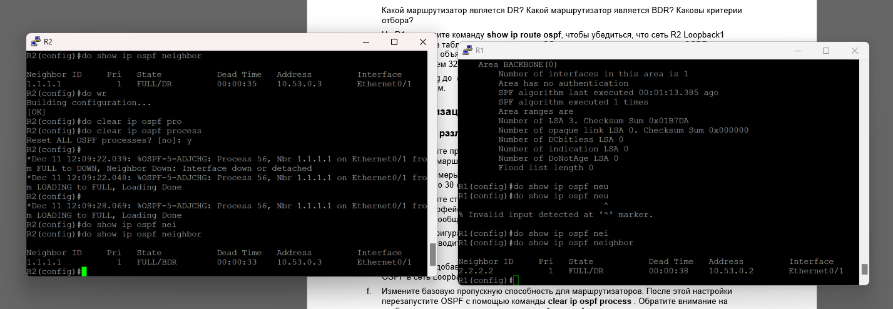
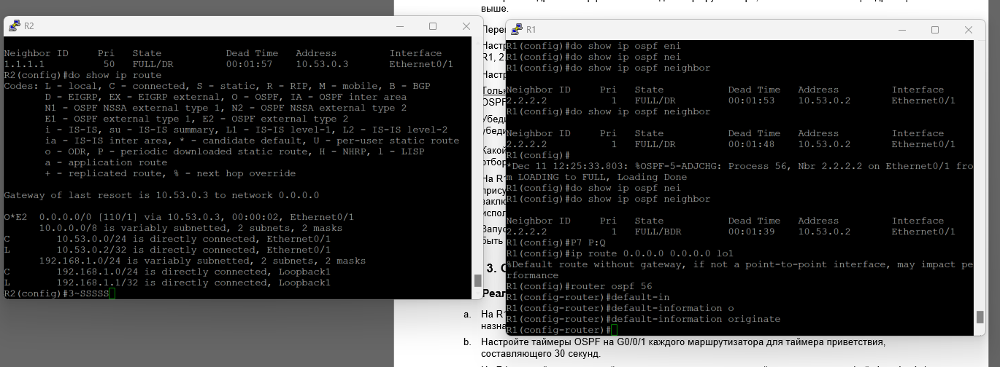

#  Лабораторная работа. Настройка протокола OSPFv2 для одной области

###  Задание:

+ Часть 1. Создание сети и настройка основных параметров устройства
+ Часть 2. Настройка и проверка базовой работы протокола  OSPFv2 для одной области
+ Часть 3. Оптимизация и проверка конфигурации OSPFv2 для одной области

### Топология:

### Таблица адресации:

<table>

<tr>
	<td>Устройство</td>
	<td>interface/vlan</td>
	<td>IP-адрес</td>
	<td>Маска подсети</td>
</tr>

<tr>
        <td rowspan="2">R1</td>
        <td>E0/1</td>
	  <td>10.53.0.3</td>
	  <td>255.255.255.0</td>
</tr>

<tr>
        <td>Loopback 1</td>
	  <td>172.16.1.1</td>
	  <td>255.255.255.0</td>
</tr>

<tr>
        <td rowspan="2">R2</td>
        <td>E0/1</td>
	  <td>10.53.0.2</td>
	  <td>255.255.255.0</td>
</tr>

<tr>
        <td>Loopback 1</td>
	  <td>192.168.1.1</td>
	  <td>255.255.255.0</td>
</tr>

</table>

### Домашнее задание:

Выполним базовую конфигурацию маршрутизаторов

Выполним базовую конфигурацию коммутаторов

Настроим интерфейсы на маршрутизаторах 

Создадим экземпляр OSPF на маршрутизаторах, назначим им ид и включим OSPF на интерфейсах

Включим ospf на lo1 R2

Проверим таблицу соседей ospf на маршрутизаторах и удостоверимся в работе протокола маршртутизации и убедимся, что маршрутизатор с id 2.2.2.2 стал ДР тк имеет больший айди

Проверим , что на R1 появился маршрут до 192.168.1.1

Пропингуем lo1 R2

На R1 e0/1 установим приоритет порта на 50 и на интерфейсах маршрутизаторах установим хеллоу интервал на 30 сек. R1 должен стать DR

На R1 объявим маршрут по умолчанию до lo1 и вкинем его в ospf. На R2 проверим, что он появился.

На R2 на интерфейсе lo1 объявим режим точка-точка

На R2 lo1 включим пассивный режим

Изменим пропускную способность маршрутизаторов, перезапустим ospf и проверим что параметр применился

Убедимся, что на R1 e0/1 является Dr, приоритет порта 50, хеллоу интервар стоит на 30 и деад интервал на 120. На R1 посмотрим таблицу маршрутизации и убедимся ,что там есть R2 lo1. На R2 просмотрим таблицу маршрутизации и убедимся, что в ней есть только маршрут по умолчанию. Выполним пинг до R1 lo1 с R2.

Вопрос : Почему стоимость OSPF для маршрута по умолчанию отличается от стоимости OSPF в R1 для сети 192.168.1.0/24?

Ответ : потому что у нас 10.53.0.0/24 connected 