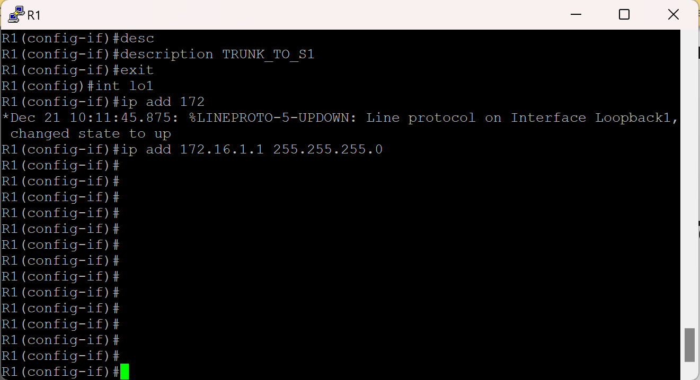
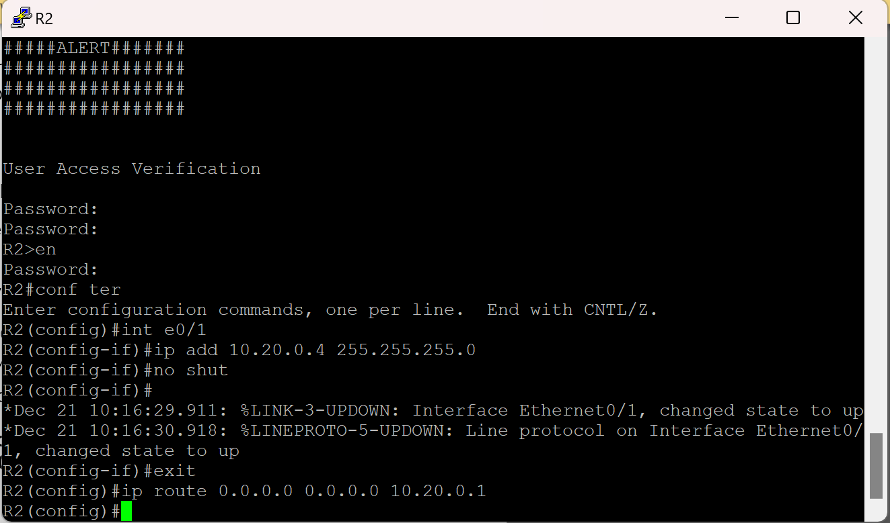
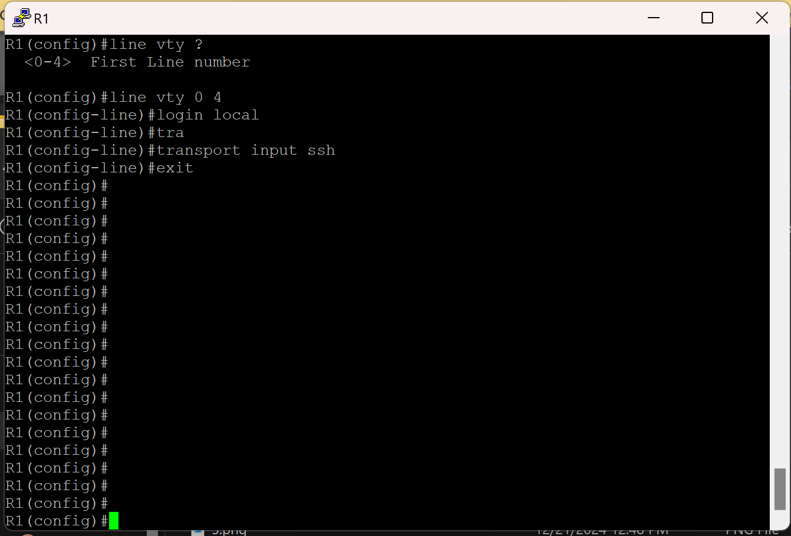

#  Лабораторная работа. Настройка и проверка расширенных списков контроля доступа.

###  Задание:

+ Часть 1. Создание сети и настройка основных параметров устройства
+ Часть 2. Настройка и проверка списков расширенного контроля доступа

### Топология:

### Таблица адресации:

<table>

<tr>
	<td>Устройство</td>
	<td>Interface</td>
	<td>IP-адрес</td>
	<td>Маска подсети</td>
	<td>Шлюз по умолчанию</td>
</tr>

<tr>
        <td rowspan="6">R1</td>
        <td>E0/1</td>
	  <td>-</td>
	  <td>-</td>
	  <td>-</td>
</tr>

<tr>
        <td>E0/1.20</td> 
	  <td>10.20.0.1</td>
	  <td>255.255.255.0</td>
	  <td>-</td>
</tr>

<tr>
        <td>E0/1.30</td> 
	  <td>10.30.0.1</td>
	  <td>255.255.255.0</td>
	  <td>-</td>
</tr>

<tr>
        <td>E0/1.40</td> 
	  <td>10.40.0.1</td>
	  <td>255.255.255.0</td>
	  <td>-</td>
</tr>

<tr>
        <td>E0/1.1000</td> 
	  <td>-</td>
	  <td>-</td>
	  <td>-</td>
</tr>

<tr>
        <td>Loopback1</td> 
	  <td>172.16.1.1</td>
	  <td>255.255.255.0</td>
	  <td>-</td>
</tr>

<tr>
        <td>R2</td>
        <td>E0/1</td>
	  <td>10.20.0.4</td>
	  <td>255.255.255.0</td>
	  <td>-</td>
</tr>

<tr>
        <td>S1</td>
        <td>VLAN 20</td>
	  <td>10.20.0.2</td>
	  <td>255.255.255.0</td>
	  <td>10.20.0.1</td>
</tr>

<tr>
        <td>S2</td>
        <td>VLAN 20</td>
	  <td>10.20.0.3</td>
	  <td>255.255.255.0</td>
	  <td>10.20.0.1</td>
</tr>

<tr>
        <td>PC-A</td>
        <td>NIC</td>
	  <td>10.30.0.10</td>
	  <td>255.255.255.0</td>
	  <td>10.30.0.1</td>
</tr>

<tr>
        <td>PC-B</td>
        <td>NIC</td>
	  <td>10.40.0.10</td>
	  <td>255.255.255.0</td>
	  <td>10.40.0.1</td>
</tr>

</table>

### Таблица VLAN: 

<table>

<tr>
	<td>VLAN</td>
	<td>Имя</td>
	<td>Назначенный интерфейс</td>
</tr>

<tr>
	<td>20</td>
	<td>Mng</td>
	<td>S2: E0/3</td>
</tr>

<tr>
	<td>30</td>
	<td>Operations</td>
	<td>S1: E0/2</td>
</tr>

<tr>
	<td>40</td>
	<td>Sales</td>
	<td>S2: E0/1</td>
</tr>

<tr>
	<td>999</td>
	<td>Parking_lot</td>
	<td>Other interfaces</td>
</tr>

<tr>
	<td>1000</td>
	<td>Native</td>
	<td>-</td>
</tr>

</table>

### Домашнее задание: 

Выполним базовую настройку маршрутизаторов

Выполним базовую настройку коммутаторов

Создадим VLAN'ы на коммутаторах

Переведем порты на коммутаторе в соотв. с таблицей VLAN'ов и настроим транки

Проверим таблицу VLAN'ов

Добавим список разрешенных VLAN'ов на транк портах

Проверим таблицу транков на коммутаторах

Сохраним конфигурацию

Создадим и настроим саб-интерфейсы на R1

Создадим loopback 1 на R1

Проверим таблицу интерфейсов на R1

Настроим интерфейс и маршрут по умолчанию на R2 

Создадим профиль для ssh соединения и ключ на маршрутизаторе

Настроим линии vty и ограничим доступ только по SSH

Проверим подключение к R1 по SSH

Также настроим SSH на остальных сетевых устройствах

Попробуем включить сервер HTTPS на R1, но получим ошибку

Настроим ip-адресацию на хостах

Исправим настройки разрешенных VLAN'ов на транк портах

Пропингуем адреса из таблицы. В качестве хостов я использовал роутеры тк VPC  не поддерживает SSH

Создадим Acl и повесим его на вход интерфейса e0/1.40

Проверим доступ по SSH с сети 10.40.0.0 к 10.20.0.0 и в первый раз получит положительный результат, но после активации acl соединение на создается, но если сделать подключение через lo1 то все ок

Запретим icmp запросы с сеткам 10.40.0.0 к 10.20.0.0 и 10.30.0.0, но к другим разрешим и проверим

Создадим новый асл лист , который запрещает эхо запросы с сети 10.30.0.0 к 10.40.0.0, но остальные разрешены

Проверим, что правила работают

Выполним проверки в соотв. с таблицей 

Проверить порты 80 и 443 не смог тк у меня не поднялся http и https