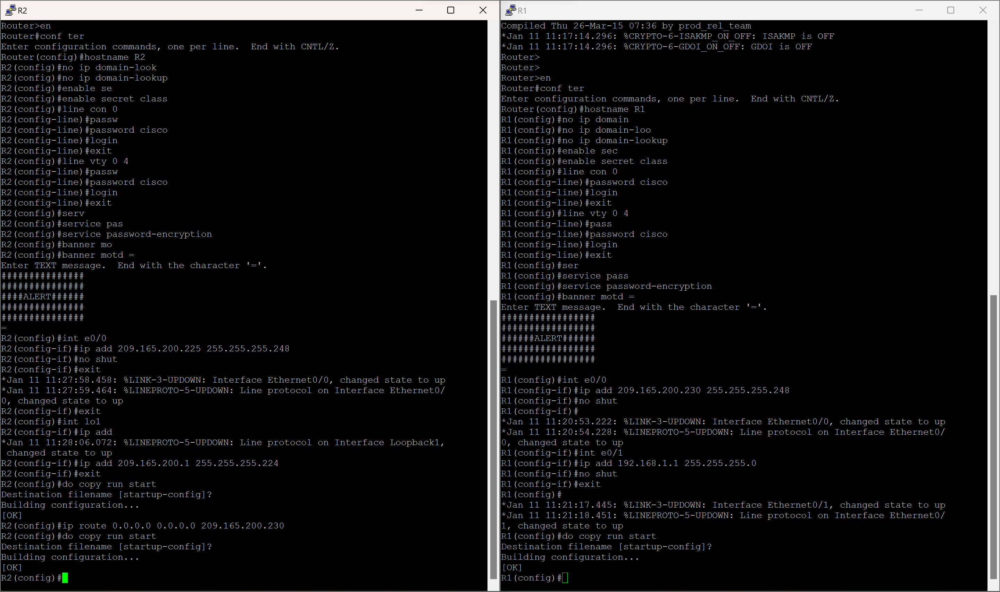
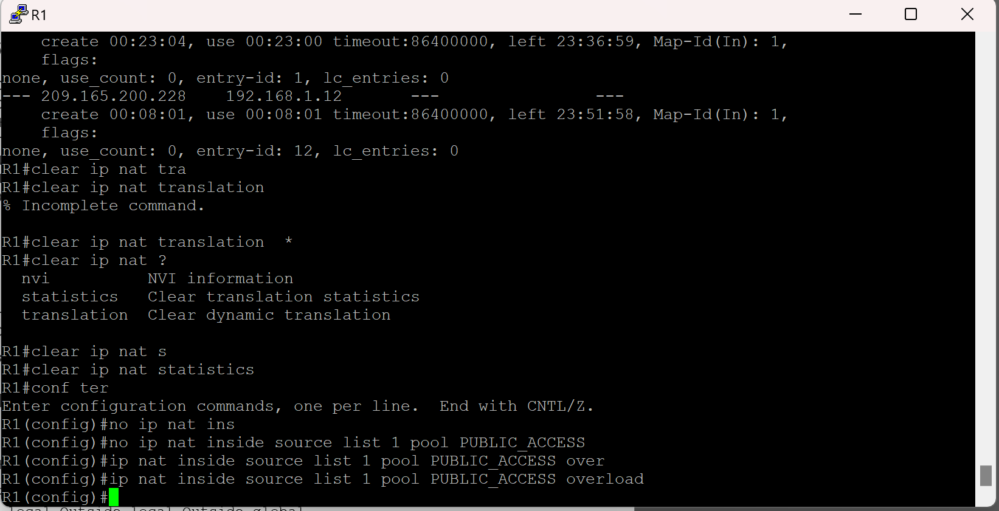

#  Лабораторная работа - Настройка NAT для IPv4.

###  Задание:

+ Часть 1. Создание сети и настройка основных параметров устройства
+ Часть 2. Настройка и проверка NAT для IPv4
+ Часть 3. Настройка и проверка PAT для IPv4
+ Часть 4. Настройка и проверка статического NAT для IPv4.

### Топология:

### Таблица адресации:

<table>

<tr>
	<td>Устройство</td>
	<td>Interface</td>
	<td>IP-адрес</td>
	<td>Маска подсети</td>
</tr>

<tr>
        <td rowspan="2">R1</td>
        <td>E0/0</td>
	  <td>209.165.200.230</td>
	  <td>255.255.255.248</td>
</tr>

<tr>
        <td>E0/1</td> 
	  <td>192.168.1.1</td>
	  <td>255.255.255.0</td>
</tr>

<tr>
        <td rowspan="2">R2</td> 
	  <td>E0/0</td>
	  <td>209.165.200.225</td>
	  <td>255.255.255.248</td>
</tr>

<tr>
        <td>lo1</td> 
	  <td>209.165.200.1</td>
	  <td>255.255.255.224</td>
</tr>

<tr>
        <td>S1</td> 
	  <td>VLAN 1</td>
	  <td>192.168.1.11</td>
	  <td>255.255.255.0</td>
</tr>

<tr>
        <td>S2</td> 
	  <td>VLAN 1</td>
	  <td>192.168.1.12</td>
	  <td>255.255.255.0</td>
</tr>

<tr>
        <td>PC-A</td>
        <td>NIC</td>
	  <td>192.168.1.2</td>
	  <td>255.255.255.0</td>
</tr>

<tr>
        <td>PC-B</td>
        <td>NIC</td>
	  <td>192.168.1.3</td>
	  <td>255.255.255.0</td>
</tr>

</table>

### Домашнее задание:

Выполним базовую настройку маршрутизаторов, настроим интерфейсы и пропишем маршрут по умолчанию на R2 к R1

Выполним базовую настройку коммутаторов и svi интерфейсов

Отключим неиспользуемые интерфейсы

Создадим аксесс лист 1 и разрешим в нем сетку 192.168.1.
Также создадим нат пулл, который будет срабатывать на аксесс лист выше.
Свяжем акксес лист и пулл, повесим пулл на вход e0/1 и на выход e0/0.

Пропингуем lo1 c PC-B на R2 и проверить nat таблицу на R1

Вопрос: Во что был транслирован внутренний локальный адрес PC-B?

Ответ: 209.165.200.226
 
Вопрос: Какой тип адреса NAT является переведенным адресом?

Ответ: Не очень понял вопрос

Сделаем тоже самое, но с PC-A

Вопрос: Во что был транслирован внутренний локальный адрес PC-B?

Ответ: 209.165.200.227
 
Вопрос: Какой тип адреса NAT является переведенным адресом?

Ответ: Не очень понял вопрос

Включим маршрутизацию, настроим маршрут по умолчанию на SW2 и попробуем пропинговать R2 lo1. Все успешно пингуется, тк у нас отсался 1 адресс, в нас пуле, в запасе

Проверим таблицу соотв. нат пула с адресом устройств 

Обнулим тамблицу нат

Соединим акксес лист с нам пулом, но уже с перегрузкой

Снова пропингуем lo1 R2  и проверим нат таблицу на R1

Вопрос: Во что был транслирован внутренний локальный адрес PC-B?

Ответ: 209.165.200.228
 
Вопрос: Какой тип адреса NAT является переведенным адресом?

Ответ: Не очень понял вопрос

Вопрос: Чем отличаются выходные данные команды show ip nat translations из упражнения NAT?

Ответ: в pat отсутствует жесткая привязка адреса хоста и адреса из нат пула

Также выполним пинг с PC-A, проверим нат таблицу и таблицу соотв.

Пропингуем lo1 сразу с нескольких хостов и проверим нат таблицу на R1

Вопрос: Как маршрутизатор отслеживает, куда идут ответы? 

Ответ: По номеру порта

Очистим нат таблицу 

Удалим соотв. акксес листа с нат пулом и удалим сам нат пулл. И включим pat перегрузку интерфейса.

Пропингуем с обоих хостов и проверим нат таблицу. Видим, что натируется через ip порта маршрутизатора.

Очистим нат таблицу.

Настроим статический нат с адреса 192.168.1.2 на 209.165.200.229

Проверим таблицу нат 

 
 