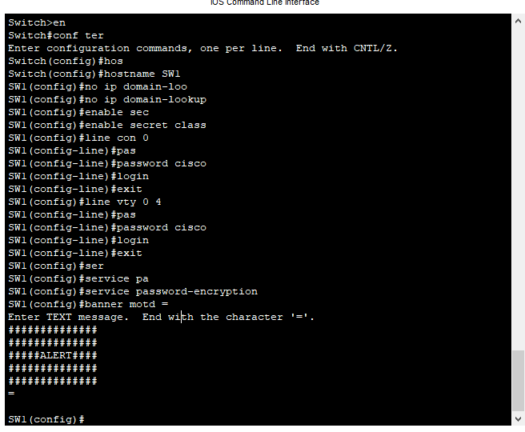
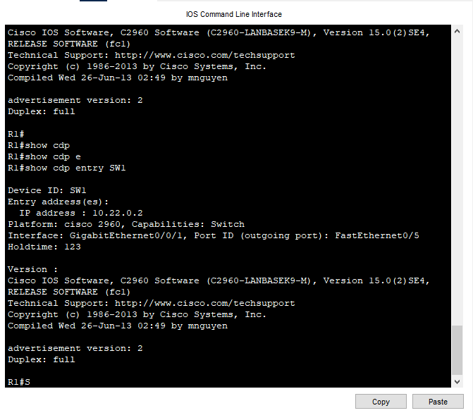
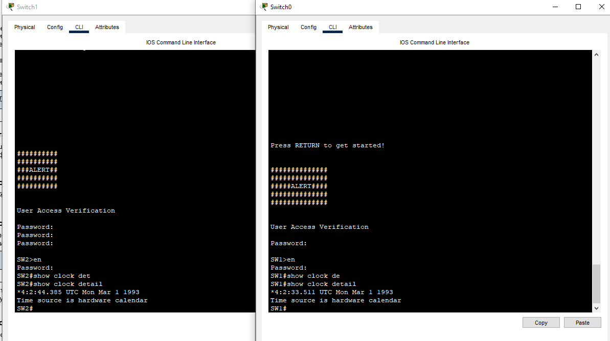

Лабораторная работа - Настройка протоколов CDP, LLDP и NTP

###  Задание:

+ Часть 1. Создание сети и настройка основных параметров устройства
+ Часть 2. Обнаружение сетевых ресурсов с помощью протокола CDP
+ Часть 3. Обнаружение сетевых ресурсов с помощью протокола LLDP
+ Часть 4. Настройка и проверка NTP

### Топология:

### Таблица адресации:

<table>

<tr>
	<td>Устройство</td>
	<td>Interface</td>
	<td>IP-адрес</td>
	<td>Маска подсети</td>
	<td>Шлюз по умолчанию</td>
</tr>

<tr>
        <td rowspan="2">R1</td>
        <td>Loopback1</td>
	<td>172.16.1.1</td>
	<td>255.255.255.0</td>
	<td rowspan="2"> - </td>
</tr>

<tr>
        <td>G0/0/1</td> 
	<td>10.22.0.1</td>
	<td>255.255.255.0</td>
</tr>

<tr>
        <td>S1</td> 
	<td>SVI VLAN 1</td>
	<td>10.22.0.2</td>
	<td>255.255.255.0</td>
	<td>10.22.0.1</td>
</tr>

<tr>
        <td>S2</td> 
	<td>SVI VLAN 1</td>
	<td>10.22.0.3</td>
	<td>255.255.255.0</td>
	<td>10.22.0.1</td>
</tr>

</table>

### Домашнее задание:

Выполним базовую настройку маршрутизатора

Выполним базовую настройку коммутаторов и отключим неиспользуемые порты

Проверим интерфейсы учавствующие в рассылке cdp 

Вопрос: Сколько интерфейсов участвует в объявлениях CDP? Какие из них активны?

Ответ: Все 4, но активный из них только G0/0/1

Проверим версию IOS на SW1

Вопрос: Какая версия IOS используется на  S1

Ответ: Version 15.0(2)SE4

CPT не поддерживает комманду sh cdp traffic

Настроим SVI интерфейсы и пропишем маршрут по умолчанию

Снова проперим данные про SW1 , через R1 и увидим ip адрес SVI

Отключим CDP на всех устройствах и портах

Включим LLDP на всех устройствах

CPT не поддерживает комманду sh lldp entry 

Вопрос: Что такое chassis ID  для коммутатора S2?

Ответ: Это уникальный идентификатор, каждый сетевой элемент, поддерживающий LLDP, имеет свой уникальный Chassis id

Выполним комманду sh lldp neighbors на всех устройствах 

Выполним комманду sh clock detail на R1

 <table>

<tr>
	<td>Дата</td>
	<td>Время</td>
	<td>Часовой пояс</td>
	<td>Источник времени</td>
</tr>

<tr>
	<td>1 марта 1993</td>
	<td>3:50:37</td>
	<td> - </td>
	<td>hardware</td>
</tr>

</table>

Настроим время на R1

Настроим NTP сервер на R1

Проверим время на коммутаторах 

 <table>

<tr>
	<td>Дата</td>
	<td>Время</td>
	<td>Часовой пояс</td>
	<td>Источник времени</td>
</tr>

<tr>
	<td>1 марта 1993</td>
	<td>4:2:44</td>
	<td> - </td>
	<td>hardware</td>
</tr>

<tr>
	<td>1 марта 1993</td>
	<td>4:2:44</td>
	<td> - </td>
	<td>hardware</td>
</tr>

</table>

Укажем обоим коммутаторам NTP сервер и проверим статус NTP.

Проверим время на коммутаторах 

